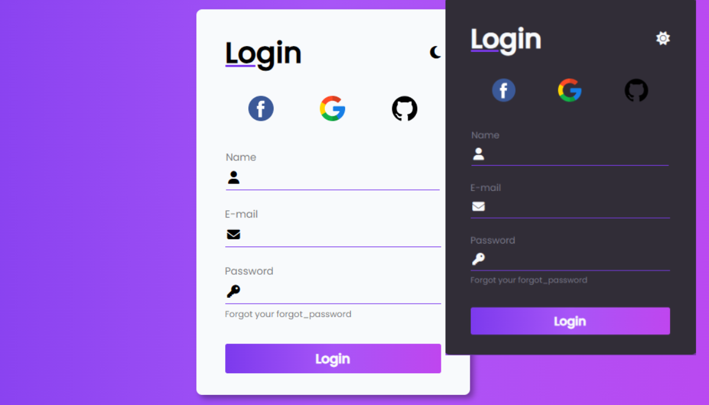

        

## 💻 Projeto DarklightForm  ⚫⚪
Formulário responsivo com Modo DARK e LIGHT
- Reproduzindo uma versão da tela inicial de login do *Github*

## 🚀 Tecnologias
Esse projeto foi desenvolvido com as seguintes tecnologoias:

- HTML5 e CSS3
- JS 

